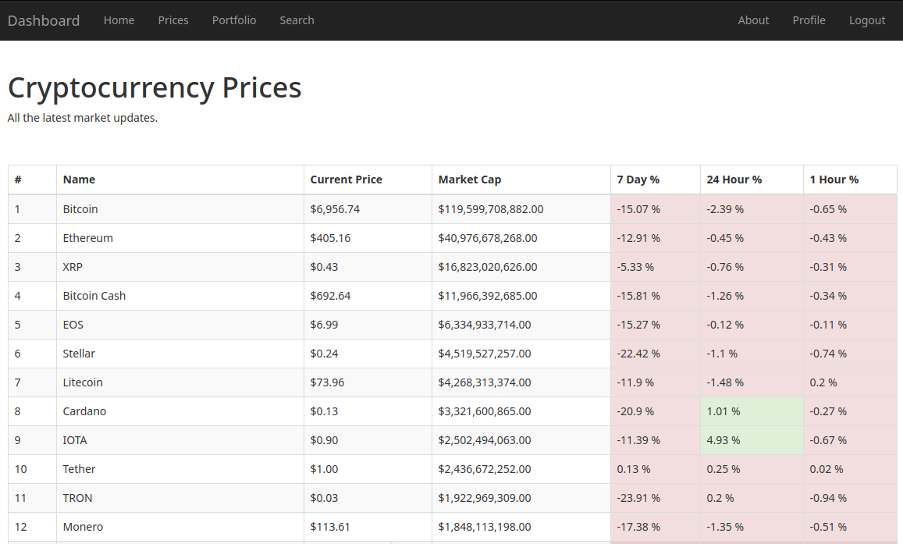
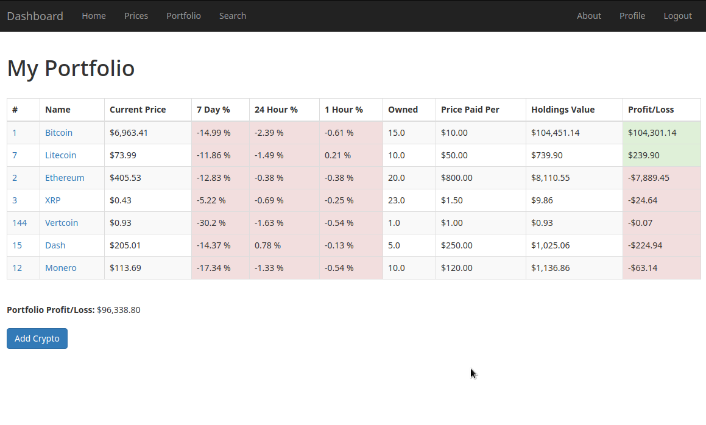

# Dashboard

Dashboard is a Ruby on Rails application that pulls data from the [Coinmarketcap API V1](https://coinmarketcap.com/api/documentation/v1/). 

The application pulls JSON data from the API, parses it and then displays the processed data. The Devise Gem is used for user authentication and saving user data. User data includes the owned amount, of an user defined currency, and the price at which the currency was bought. The app gives simple feedback in the form of profit/loss margins for each currency and the user's full portfolio. 

**Libraries or Gems used:**

* [Devise](https://github.com/plataformatec/devise) for user authentication.
* [Bootstrap V3](https://getbootstrap.com/docs/3.3/) for simple styling.

**Sample Screenshots:**

**Note:**

The app in the current for uses version 1 of the Public API. Coinmarketcap recently release the professional version of the API. The public API will be taken offline on 4 December 2018. 
